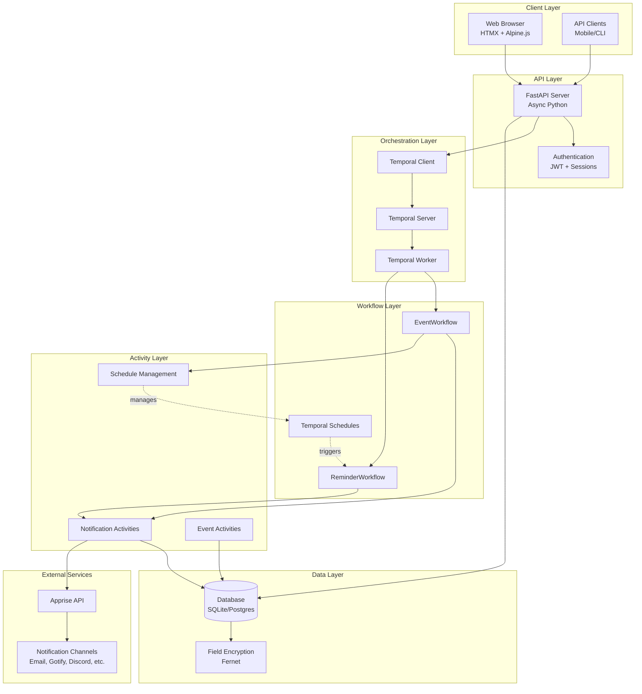
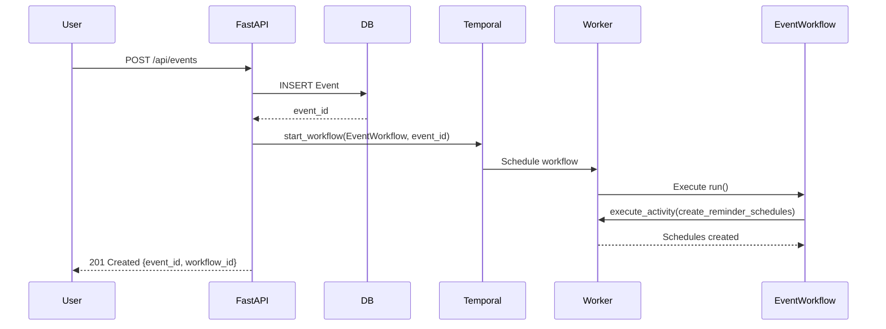
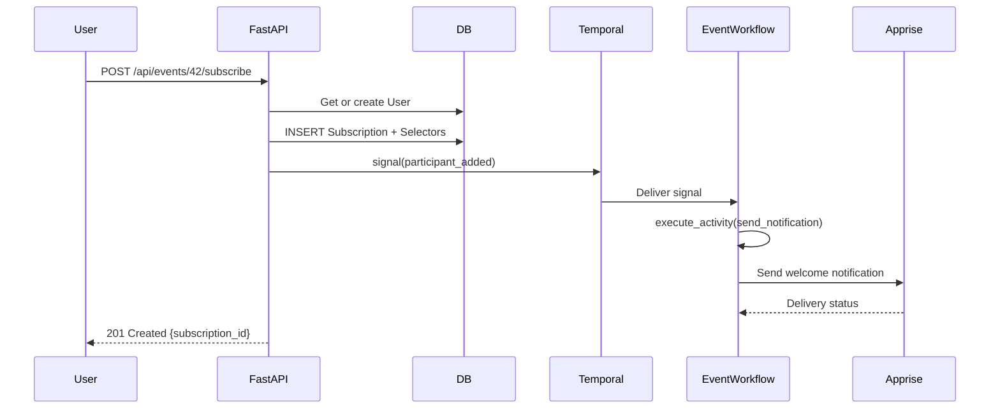
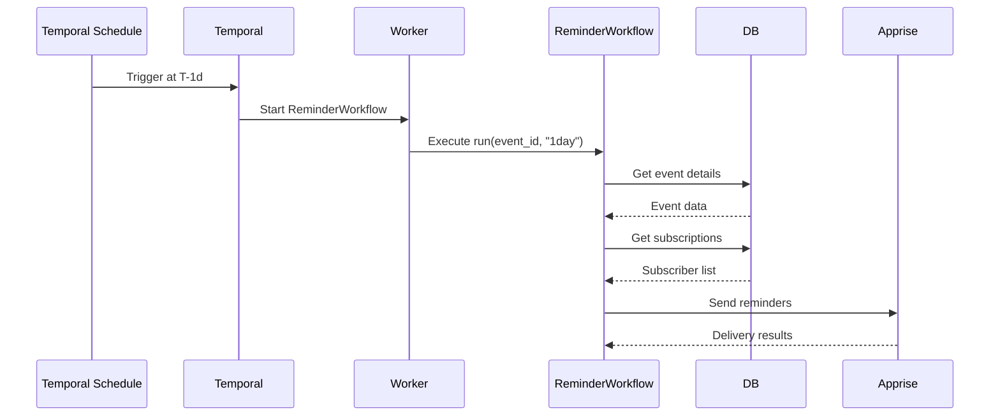
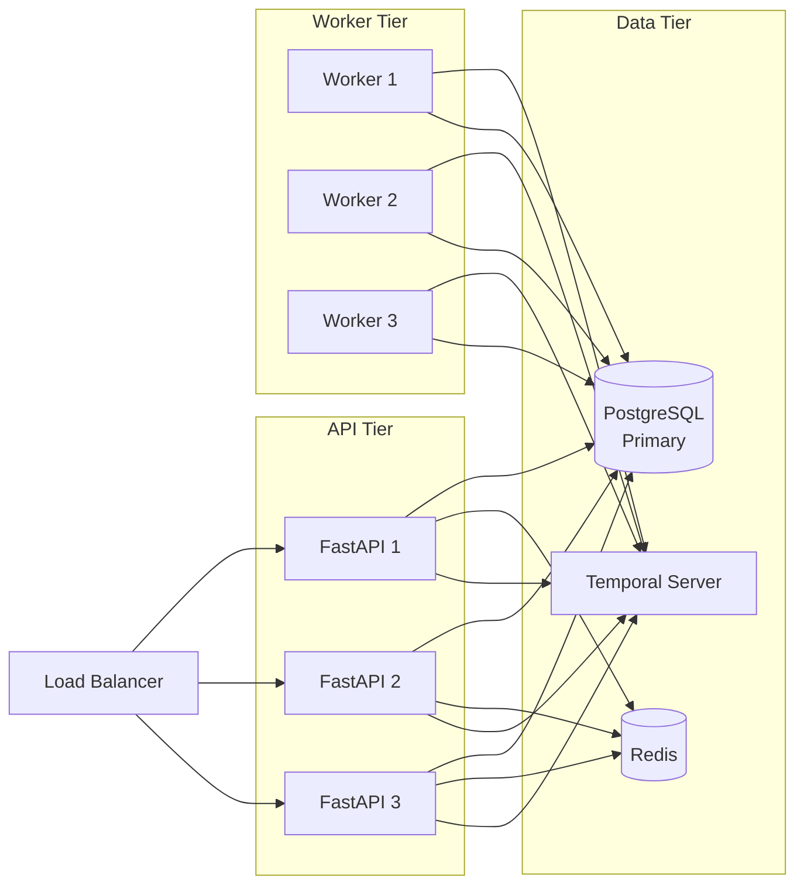

# System Overview

**Status**: Authoritative  
**Last Updated**: 2025-10-09  
**Purpose**: High-level architecture, design decisions, and system components for Soonish.

---

## Table of Contents
1. [Vision](#vision)
2. [Architecture](#architecture)
3. [Technology Stack](#technology-stack)
4. [Design Decisions](#design-decisions)
5. [System Components](#system-components)
6. [Data Flow](#data-flow)
7. [Scaling Strategy](#scaling-strategy)

---

## Vision

**Soonish** (aka Notifiq) is a notification-first event coordination service that delivers updates where users already are—not in a siloed app.

### Core Principle
Users shouldn't need to install another app or check another platform. Soonish sends notifications through channels users already use: email, Gotify, Discord, Slack, SMS, etc.

### Target Users
1. **Event Organizers**: Create events and communicate with attendees
2. **Anonymous Subscribers**: Receive updates via email without creating an account
3. **Authenticated Users**: Manage notification preferences across multiple channels

### MVP Scope
- Create public events
- Subscribe to events (anonymous or authenticated)
- Manage notification integrations (Apprise-based)
- Automatic reminders (T-1d, T-1h before event)
- Manual notifications from organizers
- Real-time event updates

---

## Architecture

### High-Level System Diagram



---

## Technology Stack

### Backend
| Component | Technology | Purpose |
|-----------|-----------|---------|
| **API Framework** | FastAPI | Async REST API with automatic OpenAPI docs |
| **Workflow Engine** | Temporal.io | Durable workflow orchestration |
| **Database** | SQLite → PostgreSQL | Development → Production |
| **ORM** | SQLAlchemy 2.x (async) | Database access with async support |
| **Migrations** | Alembic | Schema version control |
| **Encryption** | cryptography.fernet | Field-level encryption for sensitive data |
| **Auth** | python-jose + passlib | JWT tokens + password hashing |
| **Notifications** | Apprise | Multi-platform notification delivery |

### Frontend
| Component | Technology | Purpose |
|-----------|-----------|---------|
| **UI Framework** | HTMX | Server-driven reactive UI |
| **Interactivity** | Alpine.js | Minimal client-side JavaScript |
| **Styling** | TailwindCSS (planned) | Utility-first CSS |

### Infrastructure
| Component | Technology | Purpose |
|-----------|-----------|---------|
| **Package Manager** | uv | Fast Python package management |
| **Python Version** | 3.11+ | Async/await, type hints |
| **Task Queue** | Temporal task queue | Single queue for MVP: `soonish-task-queue` |

---

## Design Decisions

### 1. Temporal for Orchestration

**Decision**: Use Temporal.io as the primary orchestration engine.

**Rationale**:
- Durable workflows survive process restarts
- Built-in retry logic and error handling
- Signal-based updates enable real-time event changes
- Temporal Schedules for event-relative reminders
- No need for separate job queue or cron

**Alternatives Considered**:
- ❌ Celery: Requires Redis/RabbitMQ, less durable, complex error handling
- ❌ APScheduler: In-memory, not durable across restarts
- ❌ Custom cron: Manual retry logic, no workflow state management

---

### 2. Apprise for Notifications

**Decision**: Use Apprise library for all notification delivery.

**Rationale**:
- Supports 70+ notification services out-of-the-box
- User provides Apprise URLs (credentials embedded)
- No per-channel API integration code needed
- Extensible to new channels without code changes

**Alternatives Considered**:
- ❌ Per-service SDKs: Requires code for each service
- ❌ Zapier/IFTTT: External dependencies, cost
- ❌ Email-only: Limited channels

---

### 3. Selector-Based Subscription Routing

**Decision**: Use `subscription_selectors` table with explicit `integration_id` or `tag` routing.

**Rationale**:
- Flexible: Users can subscribe to specific integrations or tag-based groups
- Tag-based allows "send to all urgent" or "send to all email" without explicit enumeration
- Enables future per-event notification preferences
- Supports integration changes without re-subscribing

**Alternatives Considered**:
- ❌ Direct subscription → integration link: Less flexible
- ❌ User-level preferences only: Can't override per event

---

### 4. Thin Repository Pattern

**Decision**: Thin repositories for data access, orchestration in API routes.

**Rationale**:
- Repositories are pure data access (no business logic)
- FastAPI routes handle orchestration (e.g., create event → start workflow)
- Activities use same repositories (no duplication)
- Clear separation of concerns

**Alternatives Considered**:
- ❌ Fat service layer: Unclear where orchestration happens
- ❌ Active Record pattern: Mixes data and behavior

---

### 5. Dual Authentication (JWT + Sessions)

**Decision**: Support both JWT tokens and session cookies.

**Rationale**:
- Sessions for web UI (HTMX): Simpler, HttpOnly cookies
- JWT for API clients: Stateless, mobile-friendly
- Single `get_current_user` dependency works with both

**Alternatives Considered**:
- ❌ JWT-only: Requires JavaScript for cookie management
- ❌ Sessions-only: Not suitable for mobile/CLI clients

---

### 6. Anonymous → Authenticated Flow

**Decision**: Create User immediately when anonymous user subscribes, merge on account creation.

**Rationale**:
- Simplifies data model (subscriptions always have user_id)
- No session tracking needed
- Automatic merge when user verifies email
- Existing subscriptions "just work" after account creation

**Alternatives Considered**:
- ❌ Session-backed users: Complex session management
- ❌ Email-only subscriptions: Requires migration on account creation

---

### 7. Temporal Schedules for Reminders

**Decision**: Use Temporal Schedules for event-relative reminders (T-1d, T-1h).

**Rationale**:
- Decouples reminder execution from EventWorkflow
- ReminderWorkflow can be independently retried
- Schedule rescheduling on event time changes
- `workflow.sleep` reserved for ad-hoc "remind me in X hours"

**Alternatives Considered**:
- ❌ workflow.sleep in EventWorkflow: Bloats workflow history
- ❌ Cron jobs: Not event-relative, requires external scheduler

---

### 8. Two Notification Patterns

**Decision**: Distinct implementation patterns for event-driven broadcasts vs subscriber-driven reminders.

**Event-Driven (Broadcast)**:
- **Trigger**: Organizer action (update, cancel, announcement)
- **Recipients**: ALL subscribers simultaneously
- **Implementation**: Direct activity call from signal handler
- **Timing**: Immediate
- **Example**: Event location changed → Notify all NOW

**Subscriber-Driven (Personal)**:
- **Trigger**: Time-based (user's chosen reminder times)
- **Recipients**: Individual subscriber
- **Implementation**: Temporal Schedule → ReminderWorkflow → Activity
- **Timing**: Scheduled (X seconds before event)
- **Example**: User wants 1-hour reminder → Schedule fires, sends to that user only

**Rationale**:
- Clear separation of concerns prevents conflating broadcast and personal notifications
- Per-subscription schedules enable individual reminder preferences
- Event updates don't need schedules (they're immediate)
- Personal reminders aren't broadcasts (they're individual)

**Schedule Naming**:
```
event-{event_id}-sub-{subscription_id}-reminder-{offset_seconds}s
```

**See Also**: [`docs/architecture/notification-patterns.md`](./notification-patterns.md) for complete guide.

---

## System Components

### 1. FastAPI Server (`src/api/`)

**Responsibilities**:
- HTTP request handling
- Authentication/authorization
- Request validation (Pydantic)
- Orchestration (create event → start workflow)
- Response formatting

**Key Files**:
- `main.py` - Application entry point
- `routes/events.py` - Event endpoints
- `routes/subscriptions.py` - Subscription endpoints
- `routes/integrations.py` - Integration endpoints
- `routes/auth.py` - Authentication endpoints
- `dependencies.py` - Shared dependencies
- `schemas.py` - Request/response models

---

### 2. Temporal Worker (`src/worker/`)

**Responsibilities**:
- Register workflows and activities
- Poll task queue for work
- Execute workflows and activities
- Report results back to Temporal

**Key Files**:
- `main.py` - Worker initialization and registration

**Configuration**:
- Task queue: `soonish-task-queue` (configurable via env)
- Concurrency: Start with defaults, tune based on load
- Activities: Database access, Apprise calls, schedule management

---

### 3. Workflows (`src/workflows/`)

**Responsibilities**:
- Event lifecycle orchestration
- Signal handling (updates, notifications, cancellations)
- Reminder scheduling coordination
- Continue-As-New for long-running events

**Key Workflows**:
- `EventWorkflow` - Main event orchestration
- `ReminderWorkflow` - Scheduled reminder execution

---

### 4. Activities (`src/activities/`)

**Responsibilities**:
- All external I/O operations
- Database queries and updates
- Apprise API calls
- Temporal Schedule management

**Key Activities**:
- `send_notification` - Deliver notifications via Apprise
- `send_reminder_notification` - Specialized reminder delivery
- `create_reminder_schedules` - Create Temporal Schedules
- `delete_reminder_schedules` - Remove Temporal Schedules
- `validate_event_exists` - Database validation
- `get_event_details` - Fetch current event data

---

### 5. Database Layer (`src/db/`)

**Responsibilities**:
- SQLAlchemy model definitions
- Session management (async)
- Repository pattern for data access
- Encryption/decryption for sensitive fields

**Key Files**:
- `models.py` - SQLAlchemy ORM models
- `repositories.py` - Data access repositories
- `session.py` - Async session factory
- `encryption.py` - Field-level encryption
- `base.py` - Base model class

---

### 6. Configuration (`src/config.py`)

**Responsibilities**:
- Environment variable loading
- Settings validation
- Default value management
- Encryption key handling

**Key Settings**:
- Database URL
- Temporal connection
- Secret keys
- SMTP configuration (optional)
- Notification batch sizes

---

## Data Flow

### Event Creation Flow



---

### Subscription Flow



---

### Reminder Flow



---

## Scaling Strategy

### MVP (0-1k events, <1k notifications/min)

**Configuration**:
- Single FastAPI instance
- Single Temporal worker
- Single task queue: `soonish-task-queue`
- SQLite database
- In-memory session store

**Bottlenecks**: None expected at this scale

---

### Phase 2 (1k-10k events, 1k-10k notifications/min)

**Upgrades**:
- ✅ Migrate to PostgreSQL
- ✅ Multiple FastAPI instances (horizontal scaling)
- ✅ Multiple Temporal workers
- ✅ Redis for session storage
- ✅ Tune worker concurrency settings

**Optimizations**:
- Batch notification delivery
- Database connection pooling
- CDN for static assets

---

### Phase 3 (10k+ events, 10k+ notifications/min)

**Upgrades**:
- ✅ Split task queues: `soonish-workflows` + `soonish-activities`
- ✅ Dedicated activity workers (scale independently)
- ✅ Database read replicas
- ✅ Continue-As-New more aggressively
- ⚠️ Consider message broker (RabbitMQ/Kafka) if:
  - Need >50k notifications/min
  - Multiple consumers (analytics, billing)
  - Strict rate limiting per destination

**Note**: Temporal stays as orchestrator; broker (if added) is for fanout, not workflow state.

---

## Security Architecture

### Defense in Depth

1. **Transport Security**
   - HTTPS only in production
   - Secure cookie flags (HttpOnly, Secure, SameSite)

2. **Authentication**
   - Bcrypt password hashing
   - JWT signature verification
   - Session token rotation

3. **Authorization**
   - Role-based event access (organizer)
   - User-owned integration validation
   - Public/private event visibility

4. **Data Protection**
   - Field-level encryption (Apprise URLs)
   - No secrets in logs
   - Environment-based key management

5. **Rate Limiting**
   - Login attempts: 5 per 15 minutes per IP
   - API requests: 100 per minute per user (planned)
   - Notification activities: Backoff on failures

---

## Monitoring & Observability

### Key Metrics

**Application**:
- Event creation rate
- Subscription rate
- Notification delivery success rate
- API response times

**Temporal**:
- Workflow execution duration
- Activity retry rates
- Task queue depth
- Worker utilization

**Database**:
- Query performance
- Connection pool usage
- Table sizes

### Logging Strategy

**Structured JSON Logging**:
```python
{
  "timestamp": "2025-10-03T12:00:00Z",
  "level": "INFO",
  "service": "api",
  "event_id": 42,
  "workflow_id": "event-42-uuid",
  "message": "Event created successfully"
}
```

**Key Log Points**:
- All API requests/responses
- Workflow start/complete/failure
- Activity execution
- Notification delivery results

---

## Development Workflow

### Local Development

```bash
# 1. Install dependencies
uv venv
source .venv/bin/activate
uv pip install -e .

# 2. Configure environment
cp .env.example .env
# Edit .env with local settings

# 3. Start Temporal (separate terminal)
temporal server start-dev

# 4. Run database migrations
alembic upgrade head

# 5. Start worker (separate terminal)
python -m src.worker.main

# 6. Start API server
uvicorn src.api.main:app --reload

# 7. Access UI
open http://localhost:8000
```

### Testing Strategy

1. **Unit Tests**: Repositories, utilities, schemas
2. **Integration Tests**: API endpoints with test database
3. **Workflow Tests**: Temporal test server
4. **E2E Tests**: Full flows with real Temporal + database

---

## Deployment Architecture

### Production Setup



**Infrastructure**:
- API servers: 3+ instances (autoscale)
- Workers: 2+ instances (autoscale)
- PostgreSQL: Primary + read replica
- Redis: Clustered for HA
- Temporal: Managed service or self-hosted cluster

---

## Summary

This architecture provides:
- ✅ Scalable from MVP to production
- ✅ Durable workflow orchestration
- ✅ Flexible notification routing
- ✅ Clean separation of concerns
- ✅ Security by design
- ✅ Observable and debuggable
- ✅ Easy local development

**Key Strengths**:
- Temporal handles complexity of distributed workflows
- Apprise abstracts notification delivery
- Thin repositories keep code simple
- Dual auth supports multiple client types

**Trade-offs**:
- Temporal dependency (but worth the durability)
- Field encryption adds overhead (but necessary for security)
- Initial setup complexity (but pays off at scale)

**Next Steps**: See implementation/phase-plan.md for step-by-step build guide.
