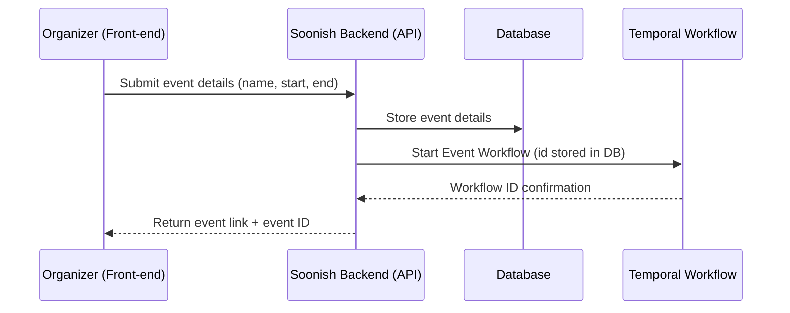
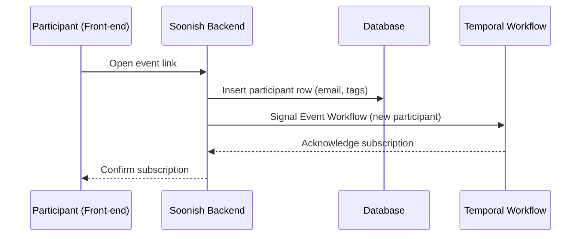
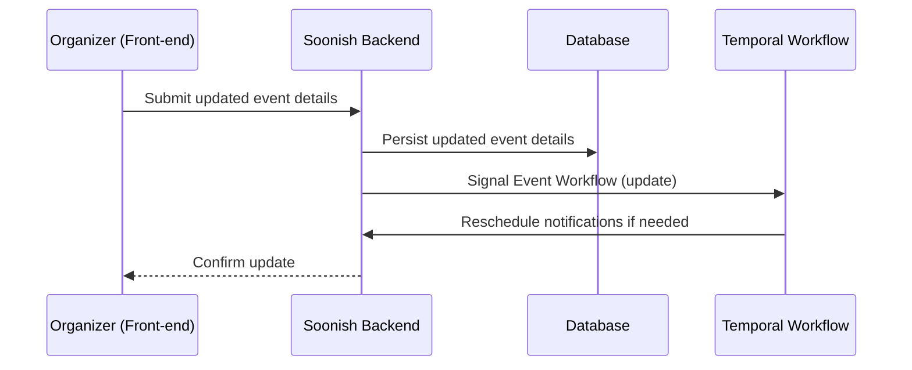
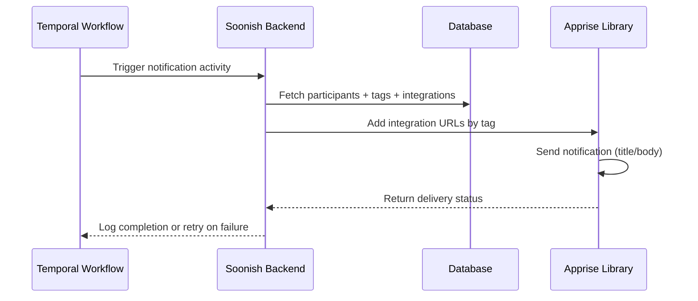
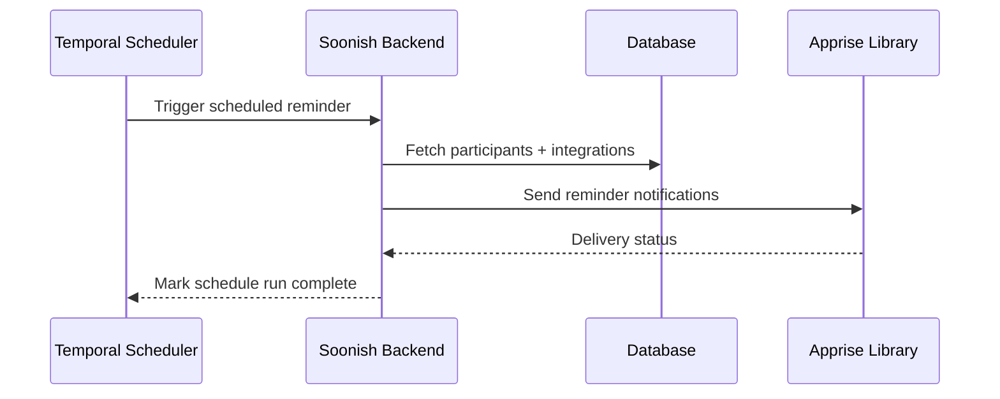

# Soonish — Functional Specification (User-Language Overview)

This document describes Soonish from the perspective of **users and workflows** rather than internal implementation. It is designed to help generate more detailed specifications later.

---

## Product Vision

Soonish is a notification-first event coordination service. Organizers can create events and communicate updates to participants without requiring participants to install a specific app or log in. Participants get updates where they already receive notifications (email, chat apps, push, etc.) through user-configured integrations.

---

## Core Concepts

### Event (Temporal Workflow)

* **Stored in Temporal:** Each event is represented by a Temporal workflow.
* **Persistent Data in DB:** Name, start/end time, extra details, and participant list.
* Workflow is responsible for scheduling notifications, handling updates, and managing reminder triggers.

### Participant (Database + Signals)

* Participant records live in the database.
* Adding a participant signals the Event workflow, which schedules notifications appropriately.

### Notifications (Temporal Activity)

* Sent by Temporal activity code using Apprise.
* Uses DB to look up participants and their integrations.
* Retries and logging handled by Temporal.

### Integrations & Tags (Database)

* Stored in `Integrations` table per user.
* User assigns tags to integrations (e.g., `email`, `urgent`).
* Notifications are sent only to integrations matching requested tags.

---

## User Workflows (Process Flows)

### 1. Organizer Creates an Event

### 2. Participant Subscribes

### 3. Organizer Updates Event

### 4. Notifications Flow

### 5. Scheduled Reminders

---

## Front-End (Loose Vision)

* **Organizer Dashboard:** List of events created by the user, with buttons for edit/update, view participants, send custom notifications.
* **Participant View:** Event details page (read-only for public users), option to subscribe via email or log in for advanced preferences.
* **Feed:** For logged-in users, a personal feed of upcoming events they are subscribed to, with clear notification history.
* Implementation will start with **htmx** + server-side templates for simplicity.

---

## High-Level Data Models

### Tables (Database)

* **User**: id, email, is\_verified, config\_key, organization\_id
* **Organization**: id, name, admin\_user\_id
* **Integrations**: id, user\_id, apprise\_url, tags
* **Event**: id, owner\_user\_id, name, start\_date, end\_date, public, allowed\_user\_ids
* **EventParticipants**: id, event\_id, user\_id/email, notification\_tags
* **EventUpdates**: id, event\_id, update\_type, content, created\_by

### Workflows (Temporal)

* **EventWorkflow**: Manages event lifecycle, reminders, updates, and notifications.
* **NotificationActivity**: Invoked by EventWorkflow to send notifications.

---

## High-Level API Endpoints

* `POST /events` → Create a new event.
* `GET /events/{id}` → Get event details.
* `PATCH /events/{id}` → Update event details.
* `POST /events/{id}/subscribe` → Add participant to event.
* `POST /events/{id}/notify` → Manually trigger a notification (organizer only).
* `GET /users/me` → Fetch logged-in user details.
* `POST /integrations` → Add new integration.
* `PATCH /integrations/{id}` → Update integration + tags.
* `DELETE /integrations/{id}` → Remove integration.

---

## Key Rules and Principles

* Temporal workflows manage event lifecycle and scheduling.
* Database stores all user, participant, and event data.
* Apprise integration is dynamically built per user from DB data.
* Front-end will remain lightweight until API and workflows are stable.
* Notifications always reflect latest DB state.

---

## Future Ideas (Not Implemented Yet)

* Participant ability to send messages or questions back to organizer.
* Group notifications for recurring events.
* Premium tier with additional integrations or higher delivery guarantees.
