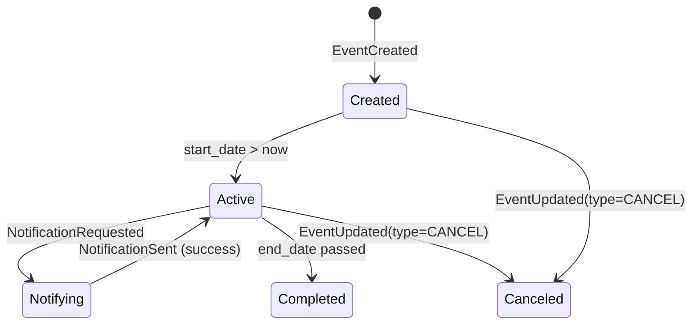

```mermaid
stateDiagram-v2
    [*] --> Created: EventCreated
    Created --> Active: start_date > now
    Active --> Notifying: NotificationRequested
    Notifying --> Active: NotificationSent (success)
    Active --> Completed: end_date passed
    Active --> Canceled: EventUpdated(type=CANCEL)
    Created --> Canceled: EventUpdated(type=CANCEL)

```