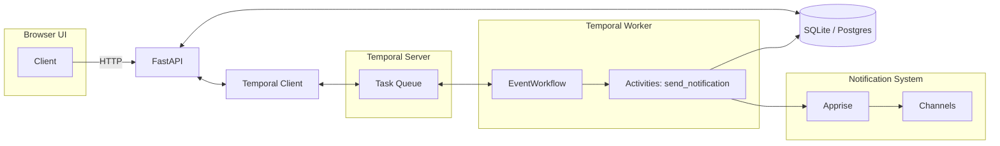
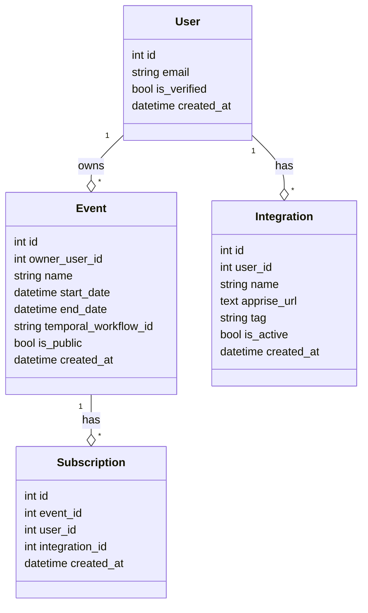
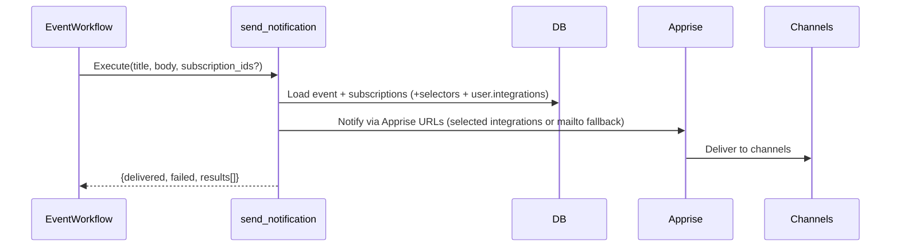
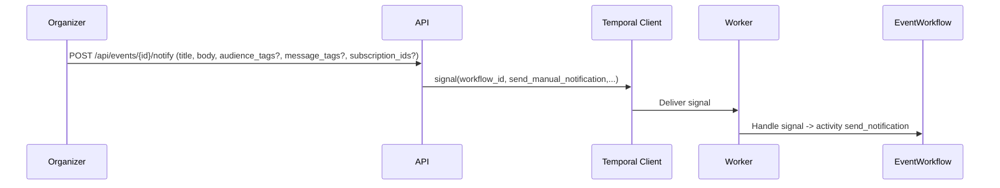

# Soonish MVP Reimplementation Plan

This plan outlines a step-by-step, incremental rebuild of the Soonish notification system based solely on the specification. Each phase includes goals, concrete deliverables, acceptance criteria, and a diagram.

## Guiding Principles
- Async-first: FastAPI + Temporal.io + async SQLAlchemy.
- Apprise-first delivery via user-managed Apprise URLs stored in `integrations`.
- SQLite locally, clean migration path to Postgres.
- HTMX + Alpine.js for minimal, reactive UI.
- Environment-driven configuration.

## Architecture Overview


---

## Phase 1 — Data Model & Database
- Goals
  - Implement data models: `users`, `events`, `subscriptions`, `event_updates`, `integrations`.
- Deliverables
  - SQLAlchemy models + async DB session utilities.
  - DB init script and migration notes.
- Acceptance
  - Tables create successfully; CRUD sanity checks pass.



---

## Phase 2 — Temporal Connectivity & Worker Skeleton
- Goals
  - Connect to Temporal server at `TEMPORAL_URL`.
  - Register `EventWorkflow` and `send_notification` activity.
- Deliverables
  - Worker entrypoint and process docs.
- Acceptance
  - Worker connects, starts, and idles on task queue.


---

## Phase 3 — Event Creation API + Workflow Start
- Goals
  - `POST /api/events` creates event and starts EventWorkflow.
- Deliverables
  - Endpoint, DB write, Temporal client start, workflow ID strategy.
- Acceptance
  - Response returns event ID + workflow ID; workflow visible in Temporal.


---

## Phase 4 — Integration Management (Apprise URLs)
- Goals
  - User creates/list/updates integrations with tags.
- Deliverables
  - `GET/POST/PATCH/DELETE /api/integrations` (auth required).
- Acceptance
  - Apprise URLs stored; tag assignments persisted.


---

## Phase 5 — Subscriptions (Anonymous + Authenticated)
- Goals
  - Allow anonymous (email-only) and authenticated users to subscribe.
  - Authenticated users can select one or more of their integrations for this event.
  - Optional participant tag preferences for content categories.
- Deliverables
  - `POST /api/events/{id}/subscribe` handling both cases.
- Acceptance
  - Subscription created; selectors stored for provided `integration_ids` and/or `tags`.
  - Workflow signaled with `participant_added`.

```mermaid
sequenceDiagram
  participant U as User
  participant UI as UI (HTMX)
  participant API
  participant DB
  participant TC as Temporal Client
  participant W as Worker
  U->>UI: Submit Subscribe form (email, integration_ids, tags)
  UI->>API: POST /api/events/{id}/subscribe (integration_ids, tags)
  API->>DB: INSERT Subscription(event_id, user_id?, email); INSERT SubscriptionSelector rows
  API->>TC: signal(event_workflow_id, participant_added, {email})
  TC->>W: Deliver signal
```

---

## Phase 6 — Notification Activity (Selector Expansion Routing)
- Goals
  - Implement `send_notification` activity reading subscriptions and resolving selectors (integration_ids and tags).
  - Fallback intent: SMTP mailto if no endpoints remain; else mark pending.
- Deliverables
  - Activity implementation and structured delivery results.
- Acceptance
  - Manual notifications deliver to selected subscriptions (or all) via resolved channels or email fallback.



---

## Phase 7 — Reminder Scheduling (T-1d, T-1h)

- Goals
  - Utilize Temporal schedules and delay-start features to schedule reminders as ReminderWorkflows
- Deliverables
  - ReminderWorkflow implementation
- Acceptance
  - Reminders fire at correct times; visible in logs.
  - Time change in event results in appropriate updates of reminders

---

## Phase 8 — Manual Notifications (Organizer)
- Goals
  - Organizer sends manual notifications to all participants according to their preferences
  - Updates assigned a category that users can choose to get notified about or opt-out of
- Deliverables
  - `POST /api/events/{id}/notify` -> signal `send_manual_notification`.
- Acceptance
  - Notifications delivered to participants based on their individual preferences
  


---

## Phase 9 — UI (HTMX + Alpine.js)
- Goals
  - Minimal pages for create event, view event, subscribe, integrations, organizer dashboard.
- Deliverables
  - Server-rendered HTML with HTMX partials.
- Acceptance
  - Full happy-path flows via browser.


---

## Phase 10 — Observability & Ops
- Goals
  - Structured logs, summary of delivery results, health checks.
- Deliverables
  - `/api/health`, Temporal connectivity check, request IDs.
- Acceptance
  - Operators can observe workflow health and delivery outcomes.


---

## Phase 11 — Security & Privacy
- Goals
  - Env-driven secrets, audit trail guidance, anonymous email hashing intent.
- Deliverables
  - Configured secrets, log redaction guidelines.
- Acceptance
  - No secrets in code; sensitive logs are filtered.

---

## Phase 12 — Cutover & Packaging
- Goals
  - Document `uv` workflows, `.env` usage, worker/app startup.
- Deliverables
  - README quickstart, Makefile or scripts, deployment notes.
- Acceptance
  - New developer can boot app and worker from spec and plan alone.

---

## Traceability to Spec
- Data models, workflows, activities, routing, and API endpoints map 1:1 to sections in `docs/user-interaction-workflows.md`.
- Open design items tracked in `docs/spec-open-questions.md`.
