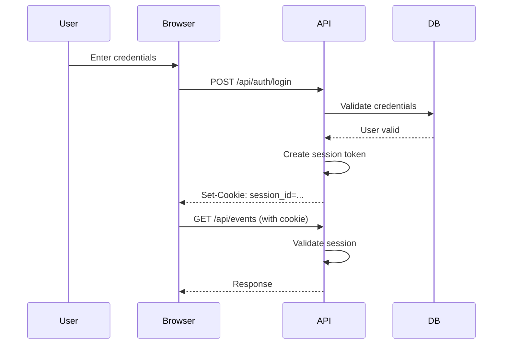
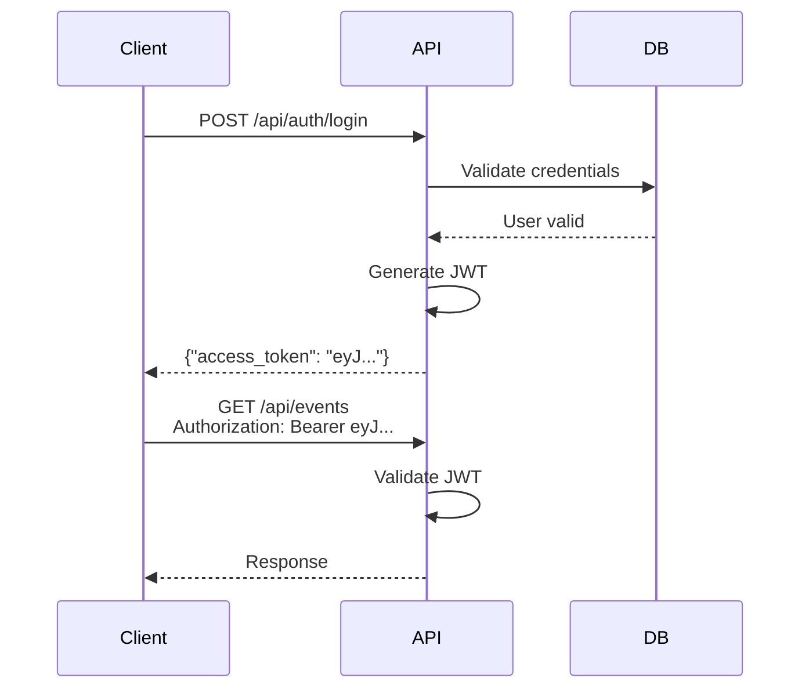

# Authentication Specification

**Status**: Authoritative  
**Last Updated**: 2025-10-03  
**Purpose**: Defines authentication flows, token management, and user identity handling for Soonish.

---

## Table of Contents
1. [Overview](#overview)
2. [Authentication Strategies](#authentication-strategies)
3. [User Flows](#user-flows)
4. [Implementation](#implementation)
5. [Security Considerations](#security-considerations)
6. [Token Management](#token-management)

---

## Overview

### Dual Authentication Strategy

Soonish supports two authentication methods:

1. **Session Cookies** (Primary for web UI)
   - Used by HTMX frontend
   - HttpOnly, Secure, SameSite cookies
   - Simple for browser-based interactions

2. **JWT Tokens** (For API clients)
   - Used by mobile apps, CLI tools, integrations
   - Stateless authentication
   - Bearer token in Authorization header

### User Types

| Type | Description | Authentication |
|------|-------------|----------------|
| **Anonymous** | Email-only subscriber | None required |
| **Unverified** | Created account but not verified email | Session/JWT (limited) |
| **Verified** | Full account with verified email | Session/JWT (full access) |

---

## Authentication Strategies

### Session Cookie Authentication

**Best for**: Web UI (HTMX frontend)

#### Flow



#### Implementation

```python
# src/api/auth/session.py
from fastapi import Response, HTTPException, Cookie
from datetime import datetime, timedelta
import secrets
from src.db.models import User
from src.db.repositories import UserRepository

# In-memory session store (use Redis in production)
_sessions: dict[str, dict] = {}

def create_session(user: User) -> str:
    """Create a new session for a user"""
    session_id = secrets.token_urlsafe(32)
    
    _sessions[session_id] = {
        "user_id": user.id,
        "email": user.email,
        "created_at": datetime.utcnow(),
        "expires_at": datetime.utcnow() + timedelta(days=7)
    }
    
    return session_id

def get_session(session_id: str) -> dict | None:
    """Get session data if valid"""
    session = _sessions.get(session_id)
    if not session:
        return None
    
    if datetime.utcnow() > session["expires_at"]:
        del _sessions[session_id]
        return None
    
    return session

def delete_session(session_id: str):
    """Delete a session"""
    _sessions.pop(session_id, None)

# FastAPI route
@router.post("/api/auth/login")
async def login_session(
    credentials: LoginRequest,
    response: Response,
    session: AsyncSession = Depends(get_db_session)
):
    # Validate credentials
    repo = UserRepository(session)
    user = await repo.get_by_email(credentials.email)
    
    if not user or not verify_password(credentials.password, user.password_hash):
        raise HTTPException(status_code=401, detail="Invalid credentials")
    
    # Create session
    session_id = create_session(user)
    
    # Set cookie
    response.set_cookie(
        key="session_id",
        value=session_id,
        httponly=True,
        secure=True,  # HTTPS only in production
        samesite="lax",
        max_age=7 * 24 * 60 * 60  # 7 days
    )
    
    return {
        "success": True,
        "data": {
            "user_id": user.id,
            "email": user.email,
            "name": user.name
        }
    }
```

---

### JWT Token Authentication

**Best for**: API clients, mobile apps

#### Flow



#### Implementation

```python
# src/api/auth/jwt.py
from datetime import datetime, timedelta
from jose import JWTError, jwt
from fastapi import HTTPException, Depends
from fastapi.security import HTTPBearer, HTTPAuthorizationCredentials
from src.config import get_settings

security = HTTPBearer()

def create_access_token(user: User) -> str:
    """Create a JWT access token"""
    settings = get_settings()
    
    payload = {
        "sub": str(user.id),
        "email": user.email,
        "is_verified": user.is_verified,
        "exp": datetime.utcnow() + timedelta(hours=1),
        "iat": datetime.utcnow()
    }
    
    token = jwt.encode(payload, settings.secret_key, algorithm="HS256")
    return token

def decode_access_token(token: str) -> dict:
    """Decode and validate JWT token"""
    settings = get_settings()
    
    try:
        payload = jwt.decode(token, settings.secret_key, algorithms=["HS256"])
        return payload
    except JWTError as e:
        raise HTTPException(
            status_code=401,
            detail=f"Invalid token: {str(e)}"
        )

# FastAPI route
@router.post("/api/auth/login")
async def login_jwt(
    credentials: LoginRequest,
    session: AsyncSession = Depends(get_db_session)
):
    # Validate credentials
    repo = UserRepository(session)
    user = await repo.get_by_email(credentials.email)
    
    if not user or not verify_password(credentials.password, user.password_hash):
        raise HTTPException(status_code=401, detail="Invalid credentials")
    
    # Generate JWT
    access_token = create_access_token(user)
    
    return {
        "success": True,
        "access_token": access_token,
        "token_type": "bearer",
        "expires_in": 3600  # 1 hour
    }
```

---

### Unified Dependency

Single dependency that works with both auth methods:

```python
# src/api/dependencies.py
from fastapi import Depends, HTTPException, Cookie
from fastapi.security import HTTPBearer
from typing import Optional
from src.api.auth.session import get_session
from src.api.auth.jwt import decode_access_token
from src.db.session import get_db_session
from src.db.repositories import UserRepository

security = HTTPBearer(auto_error=False)

async def get_current_user(
    credentials: Optional[HTTPAuthorizationCredentials] = Depends(security),
    session_id: Optional[str] = Cookie(default=None),
    db_session: AsyncSession = Depends(get_db_session)
) -> User:
    """
    Get current user from either JWT or session cookie.
    Raises 401 if not authenticated.
    """
    user_id = None
    
    # Try JWT first
    if credentials:
        payload = decode_access_token(credentials.credentials)
        user_id = int(payload["sub"])
    
    # Try session cookie
    elif session_id:
        session_data = get_session(session_id)
        if session_data:
            user_id = session_data["user_id"]
    
    if not user_id:
        raise HTTPException(
            status_code=401,
            detail="Not authenticated"
        )
    
    # Load user from database
    repo = UserRepository(db_session)
    user = await repo.get_by_id(user_id)
    
    if not user:
        raise HTTPException(status_code=401, detail="User not found")
    
    return user

async def get_current_user_optional(
    credentials: Optional[HTTPAuthorizationCredentials] = Depends(security),
    session_id: Optional[str] = Cookie(default=None),
    db_session: AsyncSession = Depends(get_db_session)
) -> Optional[User]:
    """
    Get current user if authenticated, otherwise return None.
    Used for endpoints that support both anonymous and authenticated access.
    """
    try:
        return await get_current_user(credentials, session_id, db_session)
    except HTTPException:
        return None
```

---

## User Flows

### Flow 1: Anonymous Subscription → Account Creation

**Use Case**: User subscribes to event without account, then creates account later.

#### Step 1: Anonymous Subscribe

```http
POST /api/events/42/subscribe
Content-Type: application/json

{
  "email": "user@example.com",
  "name": "John Doe"
}
```

**Backend Process**:
```python
# Check if user exists
user, created = await repo_user.get_or_create_by_email(
    email="user@example.com",
    name="John Doe"
)

# User created with is_verified=False
# Default mailto integration created automatically

# Create subscription
subscription = Subscription(event_id=42, user_id=user.id)
await repo_sub.create(subscription)

# Send welcome email with verification link
await send_welcome_email(
    user.email,
    verification_url=f"https://app.soonish.app/verify/{verification_token}"
)
```

#### Step 2: User Creates Account (Later)

```http
POST /api/auth/register
Content-Type: application/json

{
  "email": "user@example.com",
  "password": "newpassword123",
  "name": "John Doe"
}
```

**Backend Process**:
```python
# Check if user already exists
existing_user = await repo.get_by_email(request.email)

if existing_user:
    if existing_user.is_verified:
        raise HTTPException(status_code=400, detail="Email already registered")
    
    # User exists but unverified - allow setting password
    existing_user.password_hash = hash_password(request.password)
    existing_user.name = request.name
    await session.commit()
    
    # Send verification email
    verification_token = create_verification_token(existing_user)
    await send_verification_email(existing_user.email, verification_token)
    
    return {
        "success": True,
        "message": "Account created. Please verify your email.",
        "user_id": existing_user.id
    }
else:
    # Create new user
    user = User(
        email=request.email,
        name=request.name,
        password_hash=hash_password(request.password),
        is_verified=False
    )
    session.add(user)
    await session.commit()
    
    # Send verification email
    verification_token = create_verification_token(user)
    await send_verification_email(user.email, verification_token)
    
    return {
        "success": True,
        "message": "Account created. Please verify your email.",
        "user_id": user.id
    }
```

#### Step 3: Verify Email

```http
POST /api/auth/verify
Content-Type: application/json

{
  "token": "abc123..."
}
```

**Backend Process**:
```python
# Validate token
payload = decode_verification_token(request.token)
user_id = payload["user_id"]

# Mark user as verified
user = await repo.get_by_id(user_id)
user.is_verified = True
await session.commit()

# Existing subscriptions are automatically linked (same user_id)

return {
    "success": True,
    "message": "Email verified successfully"
}
```

---

### Flow 2: Direct Registration

**Use Case**: User creates account before subscribing to any events.

```http
POST /api/auth/register
Content-Type: application/json

{
  "email": "newuser@example.com",
  "password": "password123",
  "name": "Jane Smith"
}
```

**Process**: Same as Flow 1, Step 2, but always creates new user.

---

### Flow 3: Login

#### Session-Based (Web UI)

```http
POST /api/auth/login
Content-Type: application/json

{
  "email": "user@example.com",
  "password": "password123"
}

Response:
Set-Cookie: session_id=<token>; HttpOnly; Secure; SameSite=Lax
```

#### JWT-Based (API Clients)

```http
POST /api/auth/login
Content-Type: application/json
Accept: application/json

{
  "email": "user@example.com",
  "password": "password123"
}

Response:
{
  "access_token": "eyJhbGc...",
  "token_type": "bearer",
  "expires_in": 3600
}
```

**Content Negotiation**: API returns JWT if `Accept: application/json` with no browser user-agent, otherwise sets session cookie.

---

### Flow 4: Logout

#### Session-Based

```http
POST /api/auth/logout
Cookie: session_id=<token>

Response:
Set-Cookie: session_id=; Max-Age=0
```

#### JWT-Based

```http
POST /api/auth/logout
Authorization: Bearer <token>
```

No server-side action needed (JWT is stateless). Client discards token.

---

## Implementation

### Password Hashing

```python
# src/api/auth/password.py
from passlib.context import CryptContext

pwd_context = CryptContext(schemes=["bcrypt"], deprecated="auto")

def hash_password(password: str) -> str:
    """Hash a password using bcrypt"""
    return pwd_context.hash(password)

def verify_password(plain_password: str, hashed_password: str) -> bool:
    """Verify a password against its hash"""
    return pwd_context.verify(plain_password, hashed_password)
```

### Verification Token

```python
# src/api/auth/verification.py
from datetime import datetime, timedelta
from jose import jwt
from src.config import get_settings
import secrets

def create_verification_token(user: User) -> str:
    """Create email verification token (24-hour expiry)"""
    settings = get_settings()
    
    payload = {
        "sub": "email_verification",
        "user_id": user.id,
        "email": user.email,
        "exp": datetime.utcnow() + timedelta(hours=24)
    }
    
    return jwt.encode(payload, settings.secret_key, algorithm="HS256")

def decode_verification_token(token: str) -> dict:
    """Decode and validate verification token"""
    settings = get_settings()
    
    try:
        payload = jwt.decode(token, settings.secret_key, algorithms=["HS256"])
        
        if payload.get("sub") != "email_verification":
            raise ValueError("Invalid token type")
        
        return payload
    except Exception as e:
        raise HTTPException(
            status_code=400,
            detail=f"Invalid verification token: {str(e)}"
        )
```

---

## Security Considerations

### Password Requirements

```python
def validate_password_strength(password: str) -> bool:
    """Validate password meets minimum requirements"""
    if len(password) < 8:
        raise ValueError("Password must be at least 8 characters")
    
    has_digit = any(c.isdigit() for c in password)
    has_alpha = any(c.isalpha() for c in password)
    
    if not (has_digit and has_alpha):
        raise ValueError("Password must contain letters and numbers")
    
    return True
```

### Session Security

- **HttpOnly**: Prevents JavaScript access
- **Secure**: HTTPS only in production
- **SameSite=Lax**: CSRF protection
- **Max-Age**: 7 days expiration
- **Rotation**: Regenerate session ID on privilege escalation

### JWT Security

- **Short expiration**: 1 hour
- **No sensitive data**: Only user_id and basic flags
- **Signature verification**: HS256 with strong secret key
- **No refresh tokens in MVP**: Re-login after expiration

### Rate Limiting

```python
# src/api/middleware/rate_limit.py
from fastapi import Request, HTTPException
from collections import defaultdict
from datetime import datetime, timedelta

# Simple in-memory rate limiter (use Redis in production)
_attempts: defaultdict[str, list[datetime]] = defaultdict(list)

def check_rate_limit(request: Request, max_attempts: int = 5, window_minutes: int = 15):
    """Check if request exceeds rate limit"""
    client_ip = request.client.host
    now = datetime.utcnow()
    cutoff = now - timedelta(minutes=window_minutes)
    
    # Clean old attempts
    _attempts[client_ip] = [
        ts for ts in _attempts[client_ip] if ts > cutoff
    ]
    
    # Check limit
    if len(_attempts[client_ip]) >= max_attempts:
        raise HTTPException(
            status_code=429,
            detail=f"Too many attempts. Try again in {window_minutes} minutes."
        )
    
    # Record this attempt
    _attempts[client_ip].append(now)

# Usage in route
@router.post("/api/auth/login")
async def login(request: Request, credentials: LoginRequest):
    check_rate_limit(request, max_attempts=5, window_minutes=15)
    # ... rest of login logic
```

---

## Token Management

### Verification Token Lifecycle

1. **Creation**: When user registers or requests email verification
2. **Expiration**: 24 hours
3. **Single-use**: Marked as used after successful verification
4. **Storage**: Can be stored in database or encoded in JWT

### Unsubscribe Token Lifecycle

1. **Creation**: When user subscribes to event
2. **Expiration**: 60 days
3. **Single-use**: Marked as used after unsubscribe
4. **Storage**: Database table (see data-models.md)

### Session Token Lifecycle

1. **Creation**: On successful login
2. **Expiration**: 7 days (configurable)
3. **Revocation**: On logout or manual invalidation
4. **Storage**: In-memory (dev), Redis (production)

### JWT Lifecycle

1. **Creation**: On successful login
2. **Expiration**: 1 hour (short-lived)
3. **Revocation**: Not supported (stateless)
4. **Storage**: Client-side only

---

## Complete Auth Endpoints

```python
# src/api/routes/auth.py
from fastapi import APIRouter, Depends, Response, HTTPException
from src.api.schemas import (
    LoginRequest, RegisterRequest, VerifyEmailRequest,
    PasswordResetRequest
)

router = APIRouter(prefix="/api/auth", tags=["authentication"])

@router.post("/register")
async def register(
    request: RegisterRequest,
    session: AsyncSession = Depends(get_db_session)
):
    """Register new user or set password for existing unverified user"""
    # Implementation shown in Flow 1, Step 2
    pass

@router.post("/login")
async def login(
    request: LoginRequest,
    response: Response,
    session: AsyncSession = Depends(get_db_session)
):
    """Login with email and password (returns JWT or sets session cookie)"""
    # Implementation shown above
    pass

@router.post("/logout")
async def logout(
    response: Response,
    session_id: Optional[str] = Cookie(default=None)
):
    """Logout (clear session cookie or invalidate token)"""
    if session_id:
        delete_session(session_id)
        response.delete_cookie("session_id")
    
    return {"success": True, "message": "Logged out successfully"}

@router.post("/verify")
async def verify_email(
    request: VerifyEmailRequest,
    session: AsyncSession = Depends(get_db_session)
):
    """Verify email address with token"""
    # Implementation shown in Flow 1, Step 3
    pass

@router.post("/resend-verification")
async def resend_verification(
    request: EmailRequest,
    session: AsyncSession = Depends(get_db_session)
):
    """Resend verification email"""
    repo = UserRepository(session)
    user = await repo.get_by_email(request.email)
    
    if not user:
        # Don't reveal if email exists
        return {"success": True, "message": "If email exists, verification sent"}
    
    if user.is_verified:
        raise HTTPException(status_code=400, detail="Email already verified")
    
    # Generate and send new token
    token = create_verification_token(user)
    await send_verification_email(user.email, token)
    
    return {"success": True, "message": "Verification email sent"}

@router.post("/password-reset-request")
async def request_password_reset(
    request: EmailRequest,
    session: AsyncSession = Depends(get_db_session)
):
    """Request password reset email"""
    # Generate token and send email (always return success to avoid enumeration)
    return {"success": True, "message": "If email exists, reset link sent"}

@router.post("/password-reset")
async def reset_password(
    request: PasswordResetRequest,
    session: AsyncSession = Depends(get_db_session)
):
    """Reset password with token"""
    # Validate token and update password
    pass
```

---

## Summary

This specification provides:
- ✅ Dual authentication (JWT + Sessions) for different client types
- ✅ Seamless anonymous → authenticated user flow
- ✅ Automatic merging of pre-existing subscriptions
- ✅ Secure password hashing and token management
- ✅ Rate limiting and CSRF protection
- ✅ Complete auth endpoint implementations
- ✅ Verification and password reset flows

**Next Steps**: Create architecture/system-overview.md for high-level system design.
