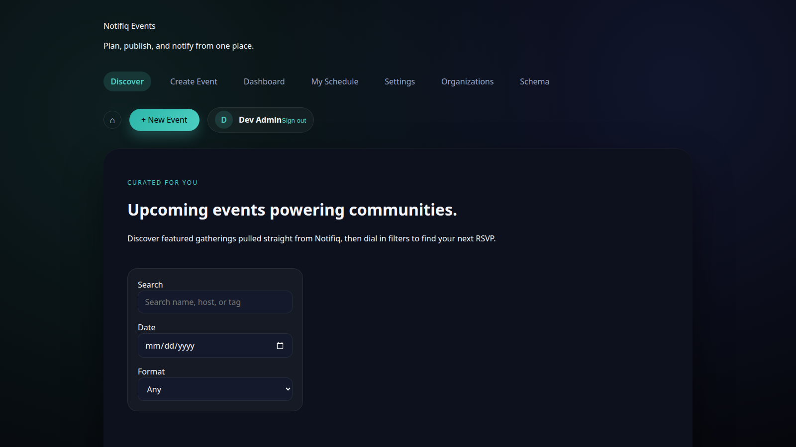

# Proof: uniform `auth_token` key across every SPA

**

**Claim:** event-planner, theater-volunteer, volunteer-coordinator used
`notifiq_<app>_access_token`; standalone-example used `token`. All now use
`auth_token` — the key every other app (and every auth/QA harness) already
expects. Closes #33.


## Change


## Claims

- Zero `localStorage` token keys besides `auth_token` remain repo-wide
- Real UI login on event-planner (the former straggler) lands exactly
  `['auth_token']` — no legacy key written:



## Evidence

## Evidence

## Not proven

- No migration shim: browsers holding an old `notifiq_*_access_token`/`token`
  key get one forced re-login. Deliberate — dev-stage product, shim is dead
  code after first load.

```bash
grep -rEho \"localStorage\\.(get|set|remove)Item\\('[^']+'\" frontend-*/src/ | sort -u
```

```output
13
```
